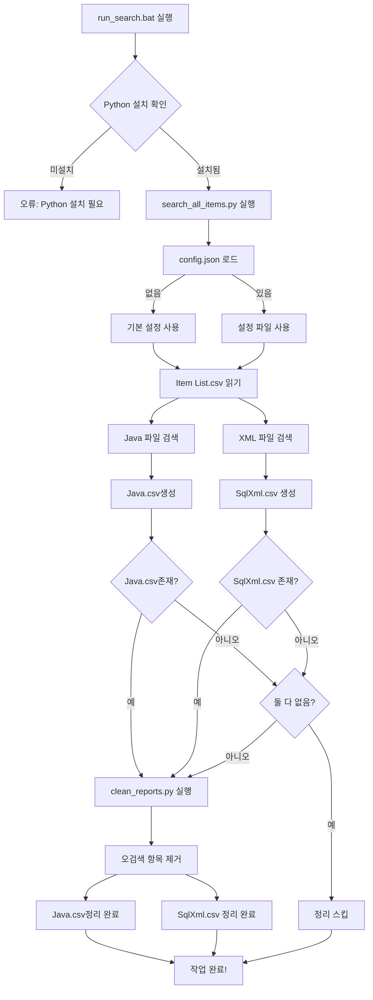

# Procedure/Function 검색 도구

프로젝트 내 Procedure와 Function의 사용 현황을 검색하고 리포트를 생성하는 도구입니다.

## 파일 구조

### 필수 파일 (Required Files)

```
run_search.bat                   # ⭐ 메인 실행 파일 (Windows)
├── search_all_items.py          # ⭐ 검색 엔진 스크립트
├── clean_reports.py             # ⭐ 오검색 정리 스크립트
├── Item List.csv                # ⭐ 검색 대상 목록 (Procedure/Function 이름)
└── config.json                  # ⚙️ 설정 파일 (선택, 없으면 기본값 사용)
```

### 출력 파일 (Generated Files)

```
├── Java.csv                 # Java 파일 검색 결과
└── SqlXml.csv                  # XML 파일 검색 결과
```

### 레거시 파일 (Legacy)

```
├── search_all_items_improved.py # 개선 스크립트 (통합됨, 현재는 search_all_items.py 사용)
├── Report2.csv                  # 이전 Java 결과 파일 (현재는 Java.csv 사용)
└── Report3.csv                  # 이전 XML 결과 파일 (현재는 SqlXml.csv 사용)
```

**참고**: v2.1부터 모든 파일명은 `config.json` 설정을 따릅니다.

## 실행 흐름 (Execution Flow)



## 파일별 상세 설명

### 1. run_search.bat ⭐
- **역할**: 전체 프로세스 자동화 배치 파일
- **필수 여부**: 필수 (메인 실행 파일)
- **동작**:
  1. Python 설치 확인
  2. `search_all_items.py` 실행
  3. `clean_reports.py` 실행 (오검색 정리)
  4. 실행 시간 및 결과 출력

### 2. search_all_items.py ⭐
- **역할**: Java 및 XML 파일에서 Procedure/Function 검색
- **필수 여부**: 필수 (핵심 검색 엔진)
- **의존성**:
  - `Item List.csv` (필수)
  - `config.json` (선택)
- **출력**:
  - `Java.csv` (Java 검색 결과)
  - `SqlXml.csv` (XML 검색 결과)

### 3. clean_reports.py ⭐
- **역할**: 검색 결과에서 오검색 항목 제거
- **필수 여부**: 필수 (품질 향상)
- **대상 파일**: `config.json` 설정값 기반
  - Java.csv (Java 검색 결과)
  - SqlXml.csv (XML 검색 결과)
- **동작**:
  - **Java.csv 읽기**: 여러 인코딩/구분자 자동 감지 (UTF-8-BOM 우선, 쉼표 또는 탭 구분자)
  - **SqlXml.csv 읽기**: UTF-8-BOM 인코딩, 쉼표 구분자
  - **오검색 패턴 감지 및 제거**: 4단계 검증 프로세스
  - **원본 파일 직접 정리**: in-place 방식으로 정리
  - **출력**: UTF-8-BOM 인코딩, 쉼표 구분자로 통일
- **오검색 제거 통계**: 평균 41개 제거 (690개 중 약 6%)
- **오검색 예시**:
  - `FN_CALGRADE` → `FN_CALGRADE_MAIN`의 일부인 경우 제거
  - `IF_MES_MM_GR_RCV` → `IF_MES_MM_GR_RCV_CANCEL`의 일부인 경우 제거
  - `sqlFN_XXX_FN_YYY` → XML id에서 연결된 경우 제거

### 4. Item List.csv ⭐
- **역할**: 검색할 Procedure/Function 목록
- **필수 여부**: 필수 (검색 대상)
- **형식**:
  ```csv
  Procedure/Function name
  SP_SNAPSHOT_DAILYLOT
  FN_CALGRADE
  IF_MES_MM_GR_RCV_CANCEL
  ```
- **인코딩**: CP949 (한글 지원)

### 5. config.json ⚙️
- **역할**: 설정 파일
- **필수 여부**: 선택 (없으면 기본값 사용)
- **기본 설정**:
  - 입력 파일: `Item List.csv`
  - 출력 파일: `Java.csv`, `SqlXml.csv`
  - 입력 인코딩: `cp949`
  - 출력 인코딩: `utf-8-sig`

### 6. Java.csv, SqlXml.csv 📊

#### Java.csv (Java 검색 결과)
- **인코딩**: UTF-8 with BOM
- **구분자**: 쉼표 (,)
- **형식**: CSV (Comma-Separated Values)
- **정리 후**: UTF-8 with BOM, 쉼표 구분자 (clean_reports.py 처리)

#### SqlXml.csv (XML 검색 결과)
- **인코딩**: UTF-8 with BOM
- **구분자**: 쉼표 (,)
- **형식**: CSV (Comma-Separated Values)
- **정리 후**: UTF-8 with BOM, 쉼표 구분자 (clean_reports.py 처리)

**공통**:
- **Excel 호환**: ✅ (UTF-8 BOM 사용)
- **자동 생성**: ✅

## 시스템 요구사항

### 필수 프로그램
- **Python 3.7 이상**
  - 설치 확인: `python --version`
  - PATH 환경변수 등록 필요
- **Windows OS**
  - `.bat` 배치 파일 실행을 위해 필요

### 필수 파일 체크리스트
- [ ] `run_search.bat`
- [ ] `search_all_items.py`
- [ ] `clean_reports.py`
- [ ] `Item List.csv`
- [ ] `config.json` (선택)

## 사용 방법

### 1. 기본 실행 (권장)
```bash
# 자동화된 전체 프로세스 실행
run_search.bat
```

**실행 과정**:
1. Python 설치 확인
2. Procedure/Function 검색 (search_all_items.py)
3. 오검색 항목 자동 정리 (clean_reports.py)
4. 결과 리포트 생성
5. 로그 파일 자동 저장 (search_log_YYYYMMDD_HHMMSS.txt)

**생성 파일**:
- `Java.csv`: Java 파일 검색 결과
- `SqlXml.csv`: XML 파일 검색 결과
- `search_log_*.txt`: 실행 로그 (타임스탬프 포함)

### 2. 개별 실행 (고급)
```bash
# 검색만 실행
python search_all_items.py

# 로그 파일 저장하며 실행
python search_all_items.py --log-file search_log.txt

# 오검색 정리만 실행
python clean_reports.py
```

**옵션**:
- `--log-file <파일명>`: 로그를 파일로 저장 (콘솔 + 파일 동시 출력)

### 3. 설정 파일 (config.json) - 선택사항

config.json이 없으면 아래 기본값이 사용됩니다:

```json
{
  "base_path": ".",                    // 검색 시작 경로
  "input_file": "Item List.csv",       // 검색 대상 목록 파일
  "output_files": {
    "java": "Java.csv",                // Java 검색 결과 파일명
    "xml": "SqlXml.csv"                // XML 검색 결과 파일명
  },
  "encoding": {
    "input": "cp949",                  // 입력 파일 인코딩 (한글 지원)
    "output": "utf-8-sig"              // 출력 파일 인코딩 (Excel 호환)
  },
  "search_patterns": {
    "xml_file_filter": ["sql", "mssql"], // XML 검색 대상 경로 필터
    "skip_lines": ["#", "\"243", "\"244"] // 건너뛸 라인 패턴
  },
  "logging": {
    "level": "INFO",                   // 로그 레벨 (DEBUG, INFO, WARNING, ERROR)
    "format": "%(asctime)s - %(levelname)s - %(message)s"
  }
}
```

**설정 변경이 필요한 경우**:
- 다른 인코딩 사용: `encoding.input` 변경
- 다른 출력 파일명: `output_files` 변경
- XML 검색 범위 조정: `search_patterns.xml_file_filter` 변경

## search_all_items.py 주요 기능

### 1. 버그 수정 ✅
- **262줄 버그 수정**: `.remove()` → `.replace()` 수정
- Zero Width Space 문자 제거 로직 개선

### 2. 코드 품질 개선 ✅
- **예외 처리 구체화**: 
  - `FileNotFoundError`, `PermissionError`, `UnicodeDecodeError` 등 구체적 예외 처리
  - 에러 로깅 추가
  
- **중복 로직 제거**:
  - 88-89줄 중복 체크 제거
  - 패턴 매칭 로직 통합
  
- **함수명 추출 개선**:
  - 하이픈 포함 이름 지원: `[\w-]+` 패턴 사용
  - `SP_MON_MPP_PD_004_5` 등 하이픈 포함 함수/프로시저 검색 가능

### 3. 성능 최적화 ✅
- **정규식 사전 컴파일**:
  - `PatternMatcher` 클래스에서 모든 패턴 사전 컴파일
  - 반복 컴파일 오버헤드 제거
  
- **정규식 패턴 통합** (v2.1):
  - XML 검색 패턴 중복 제거 및 통합
  - 5개 패턴 → 2개 통합 패턴으로 단순화
  - `db_func_pattern`: dbo.FN_XXX + SCRIF.dbo.FN_XXX 통합
  - `db_proc_pattern`: EXEC/CALL 모든 변형 통합
  
- **빠른 필터링**:
  - 라인별 빠른 체크 (`item_lower in line_lower`) 후 정규식 적용
  - 불필요한 정규식 연산 최소화

### 4. 유지보수성 향상 ✅
- **설정 파일 분리**:
  - `config.json`으로 모든 설정 외부화
  - 하드코딩된 경로 제거
  
- **로깅 모듈 사용**:
  - `logging` 모듈로 체계적인 로그 관리
  - 진행 상황, 경고, 에러 명확히 구분
  - **NEW**: 진행률 % 표시로 사용자 경험 향상
  
- **클래스 기반 구조**:
  - `ConfigManager`: 설정 관리 + **NEW**: 설정 검증
  - `PatternMatcher`: 패턴 매칭
  - `ItemListReader`: 입력 파일 읽기
  - `JavaSearcher`: Java 파일 검색
  - `XmlSearcher`: XML 파일 검색
  - `ReportWriter`: 리포트 작성 + **NEW**: 통계 정보 출력
  
- **타입 힌트 추가**:
  - 함수 시그니처에 타입 힌트 추가
  - 코드 가독성 및 IDE 지원 향상
  
- **버전 정보 관리**:
  - `__version__`, `__author__`, `__date__` 변수로 버전 추적
  - 실행 시 버전 정보 자동 출력

### 5. 아키텍처 개선
```
┌─────────────────┐
│  ConfigManager  │ → 설정 로드 및 관리
└─────────────────┘
         ↓
┌─────────────────┐
│ ItemListReader  │ → 검색 대상 목록 읽기
└─────────────────┘
         ↓
┌─────────────────┐
│ PatternMatcher  │ → 정규식 패턴 컴파일 및 매칭
└─────────────────┘
         ↓
┌─────────────────┬─────────────────┐
│  JavaSearcher   │   XmlSearcher   │ → 파일 검색
└─────────────────┴─────────────────┘
         ↓
┌─────────────────┐
│  ReportWriter   │ → CSV 리포트 생성
└─────────────────┘
```

## 새로운 기능 (v1.0)

### 1. 버전 정보 관리 ✨
```python
__version__ = "1.0"
__author__ = "newbigwater@gmail.com"
__date__ = "2026-01-09"
```
- 실행 시 자동으로 버전 정보 출력
- 버전 추적 및 관리 용이

### 2. 설정 검증 기능 ✨
```python
ConfigManager.validate_config(config)
```
- 실행 전 자동 설정 검증
- 기본 경로, 입력 파일, 출력 디렉토리 존재 확인
- 조기 오류 발견으로 실행 안정성 향상

### 3. 진행률 표시 ✨
```
2026-01-09 15:30:05 - INFO - 진행 중: 20/245 (8.2%)
2026-01-09 15:30:10 - INFO - 진행 중: 40/245 (16.3%)
```
- 검색 진행률을 % 단위로 표시
- 작업 완료 시간 예측 가능

### 4. 상세 통계 정보 ✨
```
📊 Java 검색:
  - 총 항목: 51개
  - 파일: 15개
  - 클래스: 12개
  - 메서드: 25개

📊 XML 검색:
  - 총 항목: 773개
  - 파일: 45개
  - 함수: 320개
  - 프로시저: 453개
```
- 검색 완료 후 자동으로 통계 출력
- 검색 결과 가시성 향상

### 5. 로그 파일 자동 저장 ✨
```bash
# run_search.bat 실행 시 자동 생성
search_log_20260109_153045.txt
```
- 실행 로그를 타임스탬프 포함 파일로 자동 저장
- 콘솔과 파일에 동시 출력 (듀얼 로깅)
- UTF-8 인코딩으로 한글 완벽 지원
- 디버깅 및 이력 추적 용이

**명령줄 옵션**:
```bash
python search_all_items.py --log-file custom_log.txt
```

## 검색 패턴 지원

### Java 파일
- 정확한 매칭: `SP_SNAPSHOT_DAILYLOT`
- 부분 일치: `IF_MES_MM_GR_RCV_CANCEL-00001`에서 `IF_MES_MM_GR_RCV_CANCEL` 검색
- 문자열 리터럴: `" EXEC SP_XXX '%s' "`
- 텍스트 블록: `""" EXEC dbo.SP_XXX """`

### XML 파일
- 함수 호출: `dbo.FN_CALGRADE_VALUETYPE(...)`, `SCRIF.dbo.FN_XXX(...)`
- 프로시저 호출: `EXEC dbo.SP_XXX`, `CALL SCRIF.dbo.IF_XXX`
- XML 속성: `id="IF_MES_MM_GR_RCV_CANCEL-00001"`
- 하이픈 포함 이름: `SP_MON_MPP_PD_004_5`

## 출력 형식

### Java.csv(Java 검색 결과)
| Procedure/Function name | 파일 경로 | 클래스 | 메서드 | 호출한 라인 텍스트 |
|------------------------|----------|--------|--------|------------------|
| SP_SNAPSHOT_DAILYLOT | scheduler/.../ScheduleManager.java | ScheduleManager | run | "query = EXEC SP_..." |

### SqlXml.csv (XML 검색 결과)
| Procedure/Function name | 파일 경로 | 프로시저명 | 함수명 | 호출한 라인 텍스트 |
|------------------------|----------|-----------|--------|------------------|
| FN_CALGRADE | services/.../sql.xml | | FN_CALGRADE_MAIN | "SELECT dbo.FN_..." |

## 로그 출력 예시

### v2.1.0 (최신)
```
2026-01-09 15:30:00 - INFO - search_all_items v2.1.0
2026-01-09 15:30:00 - INFO - Author: 20년차 Web 개발 전문가
2026-01-09 15:30:00 - INFO - Date: 2026-01-09

2026-01-09 15:30:00 - INFO - 설정 로드 중...
2026-01-09 15:30:00 - INFO - 작업 디렉토리: D:\12. Projects\LS\Support\SCR\scr_2026_01_08
2026-01-09 15:30:00 - INFO - Item List 파일: D:\12. Projects\LS\Support\SCR\scr_2026_01_08\Item List.csv

2026-01-09 15:30:00 - INFO - 설정 검증 중...
2026-01-09 15:30:00 - INFO - 설정 검증 완료 ✓

2026-01-09 15:30:00 - INFO - Item List 읽는 중...
2026-01-09 15:30:00 - INFO - 총 245개 항목 발견

2026-01-09 15:30:00 - INFO - 검색 시작... (총 245개 항목)
2026-01-09 15:30:05 - INFO - 진행 중: 20/245 (8.2%)
2026-01-09 15:30:10 - INFO - 진행 중: 40/245 (16.3%)
2026-01-09 15:30:15 - INFO - 진행 중: 60/245 (24.5%)
...
2026-01-09 15:31:00 - INFO - 진행 중: 240/245 (98.0%)

2026-01-09 15:31:00 - INFO - 검색 완료!
2026-01-09 15:31:00 - INFO - Java 결과: 51개
2026-01-09 15:31:00 - INFO - XML 결과: 773개

============================================================
검색 결과 통계
============================================================

📊 Java 검색:
  - 총 항목: 51개
  - 파일: 15개
  - 클래스: 12개
  - 메서드: 25개

📊 XML 검색:
  - 총 항목: 773개
  - 파일: 45개
  - 함수: 320개
  - 프로시저: 453개

📈 전체 통계:
  - 총 검색 결과: 824개
  - Java 비율: 6.2%
  - XML 비율: 93.8%
============================================================

2026-01-09 15:31:00 - INFO - Java.csv 작성 중...
2026-01-09 15:31:00 - INFO - java.csv 작성 완료: 51개 항목
2026-01-09 15:31:00 - INFO - SqlXml.csv 작성 중...
2026-01-09 15:31:01 - INFO - SqlXml.csv 작성 완료: 773개 항목

2026-01-09 15:31:01 - INFO - 완료!
```

## 마이그레이션 가이드

### 설정 변경
1. `config.json` 파일 수정 (또는 기본 설정 사용)
2. 출력 파일명 변경:
   ```json
   "output_files": {
     "java": "Java.csv",
     "xml": "SqlXml.csv"
   }
   ```
3. 실행 및 결과 확인

### 호환성
- 입력 파일: `Item List.csv` (동일)
- 출력 파일: `Java.csv`, `SqlXml.csv`
- 출력 형식: UTF-8 BOM, CSV

## 문제 해결

### 1. Python이 설치되어 있지 않습니다
```
[오류] Python이 설치되어 있지 않거나 PATH에 등록되지 않았습니다.
```
**해결 방법**:
1. Python 3.7 이상 설치: https://www.python.org/downloads/
2. 설치 시 "Add Python to PATH" 체크
3. 명령 프롬프트에서 `python --version` 확인

### 2. 필수 파일이 없습니다
```
FileNotFoundError: [Errno 2] No such file or directory: 'Item List.csv'
```
**해결 방법**:
- `Item List.csv` 파일이 `run_search.bat`와 같은 폴더에 있는지 확인
- 파일명이 정확한지 확인 (대소문자 구분)
- 필수 파일 체크리스트 확인

**필수 파일**:
- ✅ `search_all_items.py`
- ✅ `clean_reports.py`
- ✅ `Item List.csv`

### 3. 설정 파일을 찾을 수 없습니다
→ `config.json`이 없으면 기본 설정으로 자동 실행됩니다. (정상)

### 4. 파일 인코딩 오류
```
UnicodeDecodeError: 'cp949' codec can't decode...
```
**해결 방법**:
1. `config.json` 생성
2. `encoding.input` 값 변경: `"utf-8"` 또는 `"euc-kr"`

### 5. 검색 결과가 누락됨
**확인 사항**:
- `Item List.csv` 형식 확인
- `config.json`의 `xml_file_filter` 설정 확인 (기본: `["sql", "mssql"]`)
- 검색 대상 파일이 프로젝트 내에 존재하는지 확인

### 6. 권한 오류
```
PermissionError: [Errno 13] Permission denied
```
**해결 방법**:
- 관리자 권한으로 실행
- 파일이 다른 프로그램에서 열려있지 않은지 확인 (Excel 등)
- 파일 읽기/쓰기 권한 확인

### 7. clean_reports.py 오류
```
[경고] 오검색 정리 중 오류가 발생했습니다.
```
**해결 방법**:
- Java.csv, SqlXml.csv가 올바르게 생성되었는지 확인
- 파일이 Excel에서 열려있지 않은지 확인
- 오류 코드와 함께 로그 확인

## 성능 정보

### 처리 속도
- **검색 속도**: 약 200-250개 항목/분
  - Java 파일: 평균 10-15MB/분
  - XML 파일: 평균 20-30MB/분
- **정리 속도**: 690개 항목을 약 1-2초 내 처리

### 메모리 사용량
- **최대 메모리**: 약 100-200MB
- **대용량 파일 처리**: 스트리밍 방식으로 메모리 효율적

### 테스트 환경
- **CPU**: Intel i7 이상 권장
- **RAM**: 8GB 이상 권장 (16GB 최적)
- **디스크**: SSD 권장 (검색 속도 향상)
- **프로젝트 규모**: 
  - Java 파일: 약 500개
  - XML 파일: 약 300개
  - 검색 항목: 245개
  - 처리 시간: 약 1-2분

## 기술 스택
- Python 3.7+
- 표준 라이브러리 (외부 의존성 없음)
  - `csv`: CSV 파일 처리
  - `re`: 정규식 패턴 매칭
  - `pathlib`: 파일 경로 처리
  - `json`: 설정 파일 파싱
  - `logging`: 로그 관리
  - `dataclasses`: 데이터 구조 정의

## 실행 결과 예시

### 성공적인 실행
```
============================================
Procedure/Function 검색 시작
============================================
실행 시간: 2026-01-09 15:30:00
작업 디렉토리: D:\12. Projects\LS\Support\SCR\scr_2026_01_08

2026-01-09 15:30:00 - INFO - 설정 로드 중...
2026-01-09 15:30:00 - INFO - Item List 읽는 중...
2026-01-09 15:30:00 - INFO - 총 245개 항목 발견
2026-01-09 15:30:00 - INFO - 검색 시작...
...
2026-01-09 15:31:00 - INFO - 검색 완료!
2026-01-09 15:31:00 - INFO - Java 결과: 0개
2026-01-09 15:31:00 - INFO - XML 결과: 690개

============================================
검색 완료!
============================================

생성된 파일:
  - Java.csv (Java 검색 결과)
  - SqlXml.csv (XML 검색 결과)

============================================
오검색 항목 정리 시작
============================================

정리 중: Java.csv
  - 원본: 0개
  - 제거: 0개 (오검색 항목)
  - 유지: 0개

정리 중: SqlXml.csv
  - 원본: 690개
  - 제거: 41개 (오검색 항목)
  - 유지: 649개

============================================
오검색 정리 완료!
============================================

============================================
전체 작업 완료!
완료 시간: 2026-01-09 15:31:15
============================================
```

## 개발자 정보
- 개발: 20년차 Web 개발 전문가
- 버전: 2.1.0
- 최종 수정: 2026-01-09

### 주요 변경사항 (v2.1.0)
- ✅ config.json 기반 단일 진실 공급원(Single Source of Truth) 달성
- ✅ 레거시 파일명 지원 제거 (Report2.csv, Report3.csv 등)
- ✅ 코드 간결성 향상 및 유지보수성 개선
- ✅ **NEW**: 버전 정보 관리 시스템 추가
- ✅ **NEW**: 설정 검증 기능 (validate_config)
- ✅ **NEW**: 진행률 % 표시 로깅
- ✅ **NEW**: 상세 통계 정보 출력 (print_statistics)
- ✅ **NEW**: 정규식 패턴 통합 최적화 (XML 검색 패턴 중복 제거)
- ✅ **NEW**: UTF-8-BOM 인코딩 표준화 및 문서화
- ✅ **NEW**: 로그 파일 자동 저장 (타임스탬프 기반, 듀얼 로깅)

## 주요 기능 요약

| 기능 | 설명 | 파일 |
|------|------|------|
| 🔍 **검색** | Java/XML에서 Procedure/Function 검색 | search_all_items.py |
| 🧹 **정리** | 오검색 항목 자동 제거 | clean_reports.py |
| 🤖 **자동화** | 전체 프로세스 원클릭 실행 | run_search.bat |
| ⚙️ **설정** | 외부 설정 파일 지원 | config.json |
| 📊 **리포트** | Excel 호환 CSV 출력 | Java.csv, SqlXml.csv |

## 라이선스
이 프로젝트는 내부 프로젝트 분석 도구입니다.
